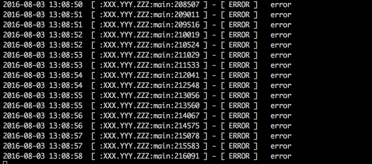

# CxxLog4j

## C++ logging library like Log4j


chinese version: [简体中文](README.zh_cn.md)


### Table of Contents
- [Characteristics](#characteristics)
- [Example](#example)
- [Configuration](#configuration)
- [Dependency](#dependency)
- [TODO](#todo)
- [Support](#support)

#### Characteristics
* Cross platform: support Linux32/64, OSX64, Win64 platforms;
* High performance: with the advantages of C/C++ and Java concurrent Libraries tegother, bursting performance;
* Easy development: High imitation from Log4j1.2, support multiple log format output, api easy to use;
* New feature: support modify log configuration file when program is running!

#### Example
  `c++:`

  ```
  #include "Efc.hh"
  #include "ELog.hh"
  
  static sp<ELogger> logger = ELoggerManager::getLogger("XXX.YYY.ZZZ");
  
  static void test_logger() {
    try {
      throw EException(__FILE__, __LINE__, "error");
    } catch (EException& e) {
	  logger->error(e);
	}
	
	logger->trace("no log file line number information");
	logger->trace(__FILE__, __LINE__, "message");
  }
  
  int main(int argc, const char **argv) {
    // CxxJDK init.
    ESystem::init(argc, argv);
    // CxxLog4j init.
    ELoggerManager::init("log4e.properties");
    
    while (true) {
      test_logger();
      
      ELoggerManager::flushConfig(); //refresh configuration!
	  EThread::sleep(500);
    }
    
    return 0;
  }
  
  ```



more examples:  
[testlog.cpp](test/testlog.cpp)  

#### Configuration
Reference the log4j 1.2 official properties configuration manual.

Example: [log4e.properties](test/log4e.properties)

New feature: `CxxLog4j` support the definition of internal variables, the method for obtaining the variable value is like `$(variable)`, see:

```
log.path = ./

log4j.appender.file.File = ${log.path}/logs/all.log
```

#### Dependency
`CxxLog4j` is based on [CxxJDK](https://github.com/cxxjava/cxxjdk).  

#### TODO
    AsyncAppender

#### Support
Email: [cxxjava@163.com](mailto:cxxjava@163.com)